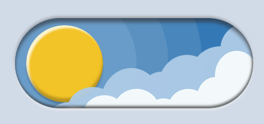
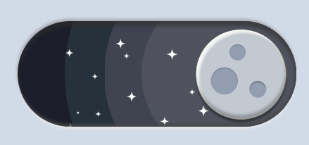

# Checkbox customizado

Implementação do checkbox presente neste [vídeo](https://www.instagram.com/p/CrbraMjgNZy/).

## Screenshots

    
    
  

  
## Observações

- Os assets foram feitos usando a ferramenta Figma;
- Confira o resultado [aqui](https://ezequias21.github.io/custom-checkbox/);
